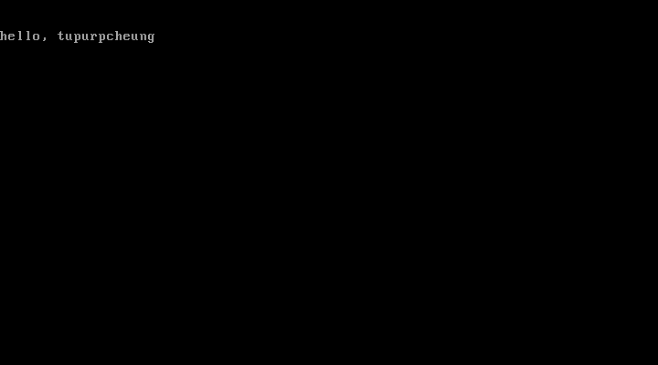

#### 一、生成镜像文件
第一天个人理解是个挺无聊的过程，所以也就没有敲源码，直接将helloos.nas拷贝过来。
生成镜像执行`asm.bat`即可。

#### 二、执行镜像文件
原文中执行镜像文件是使用一个叫做`qemu`的模拟器。
我没有使用这种方式，而是直接使用VirtualBox来加载执行helloos.img
+ 建立一个虚拟电脑
+ 设置中的存储添加软驱
+ 设置中的系统启动选择软驱
+ 启动虚拟电脑

具体可参考[virtualbox怎么添加软驱并加载软盘启动镜像](https://jingyan.baidu.com/article/fec7a1e53cdc645091b4e771.html)

至于VirtualBox如何使用和建立虚拟电脑，可自行百度。